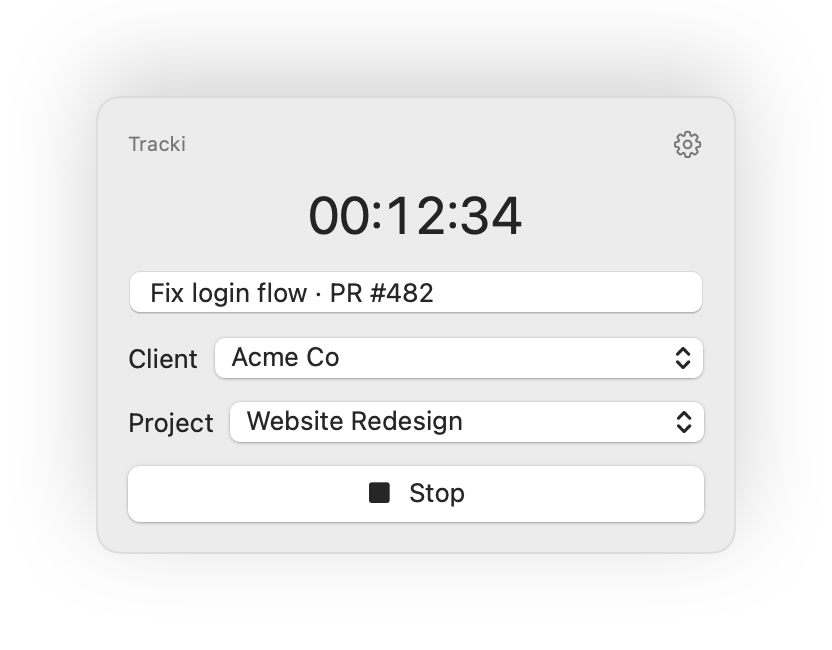

# Tracki

A lightweight, dependency-free Toggl Track menu bar app for macOS 13+.

<p align="center">
  
</p>

- Menu bar only — no Dock icon (`LSUIElement`), `NSStatusItem` + `NSPopover` with SwiftUI inside.
- Live `HH:MM:SS` in the menu bar while a timer runs; icon only when idle.
- Start/stop Toggl timers with description, project, and client pickers.
- **Two Toggl backends, auto-selected by token prefix:** classic Toggl Track v9, or Toggl 2.0 / "Focus" (`toggl_sk_…` keys). See [`docs/toggl-v2-api.md`](docs/toggl-v2-api.md).
- **Offline-first** — the timer runs locally when Toggl is unreachable and syncs automatically once it's back (queued to disk so nothing is lost, even across restarts).
- **Resilient sync** — tolerates already-stopped/missing entries (HTTP 409/404) and plan gates (HTTP 402), and surfaces a clear hint when a Toggl 2.0 Organization ID is wrong (400/403).
- GitHub PR title sync, two ways:
  1. **Active tab reader** — on popover open, reads the active tab of Safari / Chrome / Arc via AppleScript; if it's a GitHub PR, the title auto-fills.
  2. **Paste and fetch** — paste a PR URL into the title field and it's replaced with the PR title via the GitHub API.
- No external dependencies: Foundation, AppKit, SwiftUI, Security, URLSession, async/await.

## File structure

```
tracki/
├── Package.swift               # SPM build (no Xcode required)
├── project.yml                 # XcodeGen spec → Tracki.xcodeproj
├── Makefile                    # build, bundle, install Tracki.app
├── Tracki.entitlements         # com.apple.security.automation.apple-events
├── docs/toggl-v2-api.md        # reverse-engineered Toggl 2.0 / Focus API notes
├── scripts/make-icon.swift     # CoreGraphics app-icon generator → AppIcon.icns
└── Tracki/
    ├── Info.plist              # LSUIElement, NSAppleEventsUsageDescription, icon
    ├── AppIcon.icns            # app icon (Dock/Finder/Spotlight)
    ├── App/
    │   ├── TrackiApp.swift             # @main AppDelegate, activation policy, Edit menu
    │   └── StatusBarController.swift   # NSStatusItem + NSPopover wiring
    ├── Models/TogglModels.swift        # shared Codable models
    ├── Networking/
    │   ├── TogglBackend.swift          # backend protocol + factory (routes by token)
    │   ├── TogglAPIClient.swift        # classic Toggl v9 (async/await, Basic auth)
    │   ├── TogglV2Client.swift         # Toggl 2.0 / Focus (Bearer, org-scoped)
    │   └── GitHubAPIClient.swift       # PR URL parser + public GitHub API
    ├── Services/
    │   ├── BrowserTabReader.swift      # NSAppleScript active-tab reader
    │   ├── KeychainHelper.swift        # API token storage
    │   └── PendingEntryStore.swift     # on-disk offline queue for unsynced entries
    ├── ViewModels/TimerViewModel.swift # app state, timer tick, offline/sync, PR sync
    └── Views/
        ├── RootView.swift              # timer ⇄ settings switch
        ├── TimerView.swift             # pickers, start/stop, offline + unsynced UI
        └── SettingsView.swift          # API token + Organization ID, Save & Connect
```

## Install

### Homebrew (recommended)

```sh
brew install --cask mmargauxx/tap/tracki
```

Tracki is ad-hoc signed (not notarized), so on first launch either right-click the app in
`/Applications` ▸ **Open**, or install with `brew install --cask --no-quarantine mmargauxx/tap/tracki`.

Upgrade or remove:

```sh
brew upgrade --cask tracki
brew uninstall --cask tracki      # add --zap to also remove app data
```

### Direct download

Grab `Tracki.zip` from the [latest release](https://github.com/mmargauxx/tracki/releases/latest),
unzip, move `Tracki.app` to `/Applications`, and right-click ▸ **Open** the first time.

## Build from source

### Without Xcode (Command Line Tools only)

```sh
swift build   # fast debug compile
make bundle   # release build → dist/Tracki.app (ad-hoc signed)
make run      # bundle + launch from dist/
make install  # bundle + install to /Applications (launchable from Spotlight)
```

The bundle is **ad-hoc signed**, not notarized — fine on your own Mac. On another Mac,
Gatekeeper will warn the first time; right-click ▸ **Open** to allow it.

To regenerate the app icon after editing `scripts/make-icon.swift`:

```sh
swift scripts/make-icon.swift dist/AppIcon.iconset && iconutil -c icns dist/AppIcon.iconset -o Tracki/AppIcon.icns
```

### With Xcode

```sh
brew install xcodegen
xcodegen generate    # → Tracki.xcodeproj
open Tracki.xcodeproj
```

`project.yml` already sets the deployment target (13.0), `INFOPLIST_FILE`, entitlements, and hardened runtime. Build & run the `Tracki` scheme.

## Xcode setup from scratch (manual, if you don't use XcodeGen)

1. **File ▸ New ▸ Project ▸ macOS ▸ App**, product name `Tracki`, interface SwiftUI, language Swift. Delete the generated `ContentView.swift`/`TrackiApp.swift` and drag the `Tracki/` sources in.
2. **Hide from Dock (`LSUIElement`)**: select the target ▸ *Info* tab ▸ add key **Application is agent (UIElement)** (raw key `LSUIElement`), type Boolean, value **YES**. The app then never shows a Dock icon or main menu — it lives only in the menu bar.
3. **Automation permission string**: in the same *Info* tab add **Privacy – AppleEvents Sending Usage Description** (raw key `NSAppleEventsUsageDescription`) with a sentence explaining the browser-tab reading. Without this key, sending AppleEvents crashes the app on macOS.
4. **Entitlement (needed with Hardened Runtime / App Sandbox)**: target ▸ *Signing & Capabilities*:
   - If **Hardened Runtime** is on, add the *Apple Events* capability (raw entitlement `com.apple.security.automation.apple-events` = YES).
   - If you enable **App Sandbox**, also add *Outgoing Connections (Client)* for the Toggl/GitHub API calls, plus the same Apple Events entitlement.
5. **Deployment target**: macOS 13.0 (target ▸ *General*).
6. First time the app reads a browser tab, macOS shows an Automation consent prompt per browser ("Tracki wants to control Safari…"). If you decline and change your mind: **System Settings ▸ Privacy & Security ▸ Automation ▸ Tracki** and re-enable the browser.

## Usage

1. Launch — the stopwatch icon appears in the menu bar; the popover opens on the Settings screen.
2. Paste your Toggl API token and hit **Save & Connect**. The token is stored in the macOS Keychain; the default workspace, projects, and clients load automatically.
   - **Classic Toggl Track:** the 32-char token from [track.toggl.com/profile](https://track.toggl.com/profile) (bottom of the page).
   - **Toggl 2.0 / Focus** (`toggl_sk_…` keys): an **Organization ID** field appears — enter the number from the URL of your logged-in Toggl web app. (It can't be discovered from an API key; see [`docs/toggl-v2-api.md`](docs/toggl-v2-api.md).)
3. Type a description (or open the popover while a GitHub PR tab is active — it auto-fills), pick client/project, hit **Start**.
4. Title/project/client can be edited while running; changes are pushed to Toggl when you hit **Stop**.

## Notes

- The timer entry is created in Toggl at **Start** (visible as a running entry) and finalized at **Stop** (description/project updates included). No manual historical editing.
- An already-running Toggl timer (started elsewhere) is adopted on connect.
- **Offline:** if Toggl is unreachable the button reads **Start Offline** and the run is tracked locally. On stop it's queued to `~/Library/Application Support/Tracki/pending-entries.json` and pushed automatically on the next successful connect (or popover open). Anything still stuck shows in an **Unsynced** list you can dismiss once re-added.
- First time the app reads a browser tab, macOS shows an Automation consent prompt per browser. To change it later: **System Settings ▸ Privacy & Security ▸ Automation ▸ Tracki**.

## License

[MIT](LICENSE)
